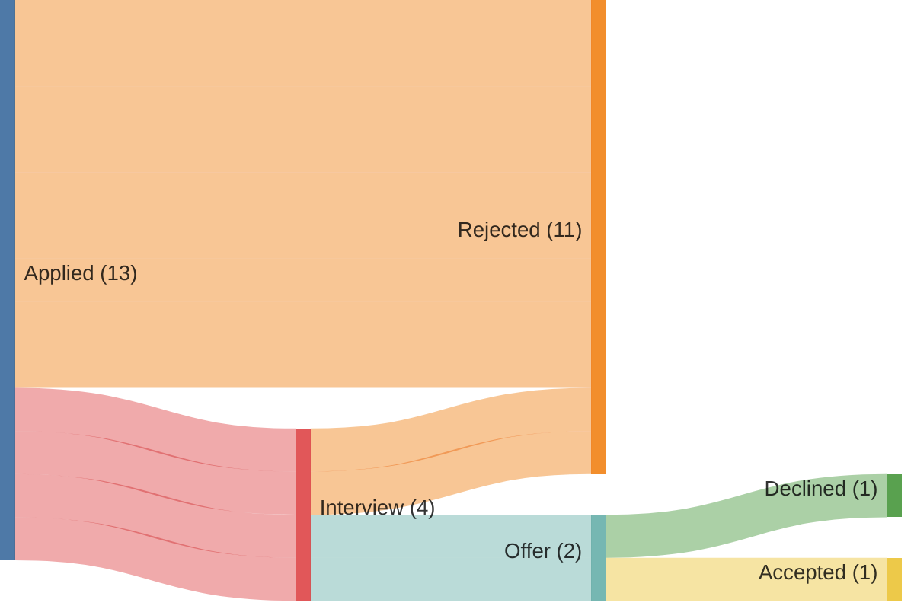

```mermaid
---
config:
  sankey:
    linkColor: target
    nodeAlignment: left
    prefix: ' ('
    suffix: ')'
---
sankey
%% Issue #13: [EnterpriseTech] Solutions Architect
Applied,Rejected,1

%% Issue #12: [InfraCorp] Platform Engineer
Applied,Rejected,1

%% Issue #11: [ScaleCo] Site Reliability Engineer
Applied,Rejected,1

%% Issue #10: [CyberSafe] Security Engineer
Applied,Rejected,1

%% Issue #9: [AppStudio] Mobile Developer
Applied,Rejected,1

%% Issue #8: [RetailCorp] Product Manager
Applied,Rejected,1

%% Issue #7: [FinTech Inc] Full Stack Developer
Applied,Rejected,1

%% Issue #6: [CloudCo] DevOps Engineer
Applied,Rejected,1

%% Issue #5: [AILabs] ML Engineer
Applied,Rejected,1

%% Issue #4: [WebAgency] Frontend Developer
Applied,Interview,1
Interview,Rejected,1

%% Issue #3: [MegaCorp] Backend Engineer
Applied,Interview,1
Interview,Rejected,1

%% Issue #2: [StartupXYZ] Data Scientist
Applied,Interview,1
Interview,Offer,1
Offer,Declined,1

%% Issue #1: [TechCorp] Software Engineer
Applied,Interview,1
Interview,Offer,1
Offer,Accepted,1
```